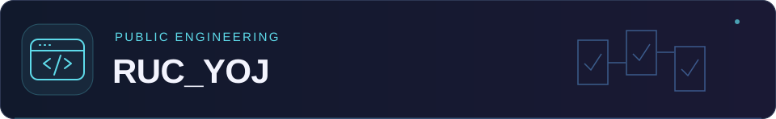
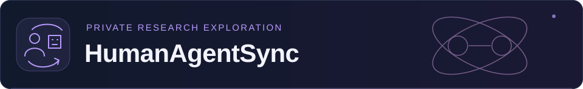
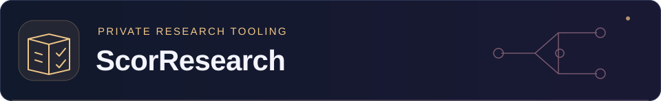

<picture>
  <source media="(prefers-reduced-motion: reduce) and (prefers-color-scheme: light)" srcset="assets/hero-light.svg#still">
  <source media="(prefers-reduced-motion: reduce)" srcset="assets/hero-dark.svg#still">
  <source media="(prefers-color-scheme: dark)" srcset="assets/hero-dark.svg">
  <source media="(prefers-color-scheme: light)" srcset="assets/hero-light.svg">
  
</picture>

### Building useful systems. Asking testable questions.

Undergraduate · **Gaoling School of Artificial Intelligence**  
**Renmin University of China**

<code>AI Systems</code> &nbsp; ✧ &nbsp;
<code>Agent Research</code> &nbsp; ✧ &nbsp;
<code>Research Tooling</code>

<a href="#about">About</a> &nbsp; / &nbsp;
<a href="#selected-work">Selected Work</a> &nbsp; / &nbsp;
<a href="#how-i-work">How I Work</a> &nbsp; / &nbsp;
<a href="#toolkit">Toolkit</a>

<picture><source media="(prefers-reduced-motion: reduce)" srcset="assets/divider.svg#still"></picture>

## About

I'm an undergraduate at the **Gaoling School of Artificial Intelligence, Renmin University of China (RUC)**, working at the intersection of **computer science foundations, AI systems, and practical engineering**.

I build tools around real needs and explore how people can work effectively with AI agents. My interests center on **human–agent collaboration, agent workflows, and research infrastructure**: making execution understandable, evidence inspectable, and decisions revisable as a project evolves.

Alongside these projects, I continue to deepen my grounding in algorithms, systems, machine learning, and mathematical modeling.

## Selected Work

<table width="100%">
<tr><td>

<strong>A campus need, engineered into a usable tool.</strong>

A searchable archive and companion toolkit for the RUC YOJ online judge, connecting problem data, solution code, verification, and quick-submission workflows. An engineering project spanning data organization, user-facing tools, and automated publication.

<code>C++</code> <code>Python</code> <code>Automation</code> <code>GitHub Pages</code>

<a href="https://scorpascal.github.io/RUC_YOJ/">Explore the website&nbsp;↗</a> &nbsp; · &nbsp; <a href="https://github.com/Scorpascal/RUC_YOJ">View the repository&nbsp;↗</a>

</td></tr>
<tr><td>

<strong>Shared understanding between people and agents.</strong>

A research workspace exploring human–agent collaboration, execution transparency, and evaluation reliability. Connects concrete questions with critical reading, empirical checks, and traceable decisions—without treating an implementation as proof of a research claim.

<code>Human–Agent Interaction</code> <code>Agent Evaluation</code> <code>Reproducibility</code>

🔒 Private research · High-level overview only

</td></tr>
<tr><td>

<strong>Research decisions that can evolve with the evidence.</strong>

Agent-oriented tooling for organizing evidence, revisiting research directions, and adapting plans to changing resources. Combines flexible model-based reasoning with structured project state, versioned records, and explicit handoffs.

<code>Python</code> <code>CLI Tooling</code> <code>State Management</code> <code>Testing</code>

🔒 Private tooling · High-level overview only

</td></tr>
</table>

## How I Work

<picture><source media="(prefers-reduced-motion: reduce)" srcset="assets/workflow.svg#still"></picture>

**Problem first.** Start with a real need, define the constraints, and turn an open-ended idea into a concrete question or useful tool.

**Evidence before confidence.** Keep tests, sources, and reproducible steps close to the claims they support. Distinguish a working implementation from a validated conclusion.

**Agent-assisted, human-directed.** Automate repeatable work while keeping requirements, review, and decisions explicit. Change the plan when the evidence changes.

## Toolkit

**AI & experimentation:** PyTorch, local model workflows, Ollama, and experiment scripting.  
**Engineering:** command-line tools, automated tests, code review, and reproducible GitHub workflows.  
**Environment:** VS Code · macOS · Linux.

<strong>📚 Foundations, coursework & mathematical modeling</strong>

 

**Systems & algorithms** — C/C++ programming, bit-level reasoning, [Data Lab exercises](https://github.com/Scorpascal/datalab2026) (course fork), and data-structure implementations.

**Mathematical modeling — CUMCM** — problem formulation, numerical computation, validation, and technical writing for a competition project. The project materials are private.

**Retrieval & RAG — course assignment** — lexical retrieval, vector search, semantic reranking, and retrieval-augmented generation.

<picture><source media="(prefers-reduced-motion: reduce)" srcset="assets/divider.svg#still"></picture>

<strong>Understand the fundamentals. Build something useful. Keep the evidence close.</strong> 
✦ &nbsp; CURIOSITY &nbsp; / &nbsp; CLARITY &nbsp; / &nbsp; CRAFT &nbsp; ✦

